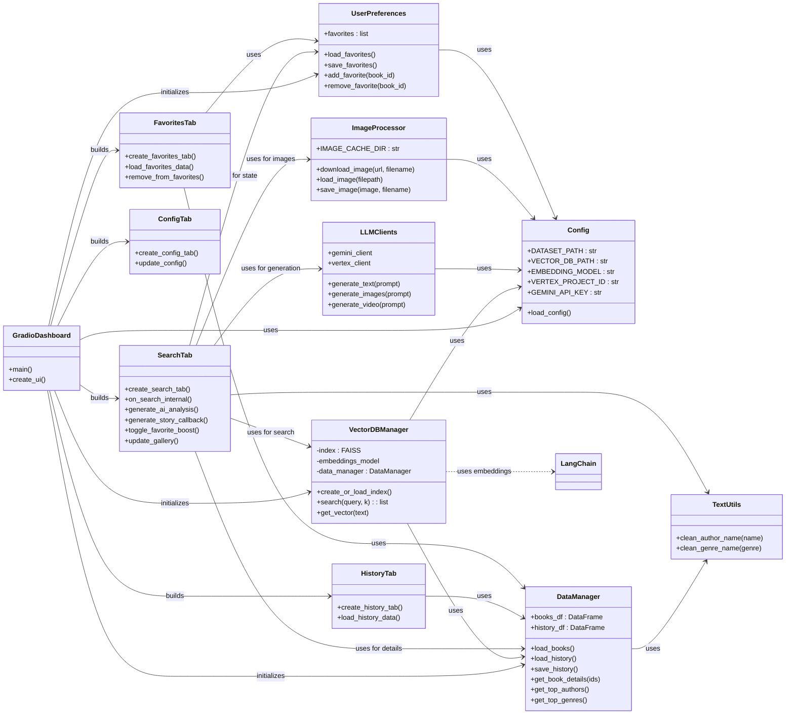

# Documentación Técnica: Semantic Book Recommender

## 1. Introducción

Esta aplicación es un recomendador semántico de li[text](https://studio.firebase.google.com/?hl%3Des-419%26_gl%3D1%2A15g83ka%2A_ga%2AODg5NzMxMDkuMTc0NTk1MDY5Ng..%2A_ga_CW55HF8NVT%2AMTc0NTk1MDY5NS4xLjAuMTc0NTk1MDY5NS4wLjAuMA..)bros construido con Python y Gradio. Permite a los usuarios buscar libros basados en descripciones de lenguaje natural, guardar favoritos, ver historial, obtener análisis generados por IA (usando Gemini/Vertex AI) y generar imágenes/videos conceptuales relacionados con los libros. Utiliza una base de datos vectorial FAISS con embeddings de `sentence-transformers` para la búsqueda semántica.

**Tecnologías Principales:**

*   **Python 3.10+**
*   **Gradio:** Framework para la interfaz de usuario web.
*   **Pandas:** Manipulación de datos.
*   **FAISS (CPU):** Base de datos vectorial para búsqueda de similitud.
*   **LangChain:** Orquestación para interactuar con modelos de lenguaje y bases de datos vectoriales.
*   **Sentence Transformers:** Generación de embeddings para texto.
*   **Google Gemini / Vertex AI:** Generación de texto e imágenes/video.
*   **Google Books API:** Obtención de metadatos de libros (opcional).
*   **Pillow:** Procesamiento de imágenes.
*   **python-dotenv:** Gestión de variables de entorno.

## 2. Arquitectura General

La aplicación sigue una arquitectura modular separando la lógica de la interfaz de usuario (UI), la gestión de datos, la configuración, la interacción con modelos de IA y las utilidades.

*   **Punto de Entrada (`gradio_dashboard.py`):** Inicializa la configuración, los gestores de datos y la base de datos vectorial. Construye la interfaz Gradio ensamblando las diferentes pestañas (Búsqueda, Historial, Favoritos, Configuración).
*   **Configuración (`modules/config.py`):** Carga parámetros desde un archivo `.env` y define constantes globales.
*   **Gestión de Datos (`modules/data_manager.py`):** Carga el dataset de libros, gestiona el historial de búsquedas y proporciona funciones para acceder a los datos.
*   **Base de Datos Vectorial (`modules/vector_db.py`):** Encapsula la lógica para crear/cargar el índice FAISS, generar embeddings y realizar búsquedas semánticas. Utiliza `DataManager` para obtener los datos.
*   **Clientes LLM (`modules/llm_clients.py`):** Centraliza la interacción con las APIs de Gemini y Vertex AI para generación de texto e imágenes.
*   **Procesador de Imágenes (`modules/image_processor.py`):** Maneja la descarga, el guardado y la carga de imágenes (portadas de libros, imágenes generadas).
*   **Preferencias de Usuario (`modules/user_preferences.py`):** Gestiona la lista de libros favoritos del usuario, guardándola/cargándola desde un archivo JSON.
*   **Módulos UI (`modules/ui/*.py`):** Cada archivo define una pestaña específica de la interfaz Gradio (`search_tab.py`, `history_tab.py`, `favorites_tab.py`, `config_tab.py`), incluyendo sus componentes (botones, galerías, etc.) y las funciones *callback* que manejan las interacciones del usuario.
*   **Utilidades (`modules/utils/*.py`):** Contiene funciones auxiliares reutilizables (ej. limpieza de texto).

## 3. Diagrama UML (Mermaid Syntax)

*Nota: Este diagrama simplifica algunas interacciones para mayor claridad.*

## 4. Flujo de Datos Principal

1.  **Inicialización (`gradio_dashboard.py`):**
    *   Se carga la configuración desde `modules/config.py` (que lee `.env`).
    *   Se inicializa `DataManager` y se cargan los datos de libros (`books.csv`).
    *   Se inicializa `VectorDBManager`, que a su vez crea o carga el índice FAISS usando los datos del `DataManager`.
    *   Se inicializa `UserPreferences` cargando los favoritos (`favorites.json`).
    *   Se llama a `create_ui()` que instancia y ensambla las pestañas (`SearchTab`, `HistoryTab`, etc.).

2.  **Flujo de Búsqueda (`SearchTab`):**
    *   Usuario introduce query y presiona "Buscar".
    *   Se activa el *callback* `on_search_internal`.
    *   Se llama a `VectorDBManager.search(query)` para obtener IDs de libros similares.
    *   Se usa `DataManager.get_book_details(ids)` para obtener los metadatos completos.
    *   (Opcional) Si `favorite_boost_state` está activo, se reordenan los resultados para priorizar favoritos.
    *   Se actualiza la galería de resultados (`results_gallery`) y otros componentes UI.
    *   Se guarda la búsqueda en el historial (`DataManager.save_history()`).

3.  **Flujo de Favoritos (`FavoritesTab`, `SearchTab`):**
    *   **Añadir (SearchTab):** Usuario hace clic en "Marcar Favorito" en un resultado. El *callback* asociado llama a `UserPreferences.add_favorite(book_id)` y `UserPreferences.save_favorites()`. Se actualiza el estado visual del botón.
    *   **Ver (FavoritesTab):** Al abrir la pestaña, `load_favorites_data` obtiene los IDs de `UserPreferences.favorites`, busca sus detalles con `DataManager.get_book_details()` y actualiza la galería de favoritos.
    *   **Quitar (FavoritesTab):** Usuario hace clic en "Eliminar de Favoritos". El *callback* `remove_from_favorites` llama a `UserPreferences.remove_favorite(book_id)`, `UserPreferences.save_favorites()` y refresca la galería.

4.  **Flujo de Historial (`HistoryTab`):**
    *   Al abrir la pestaña, `load_history_data` obtiene el `history_df` de `DataManager`, lo formatea y lo muestra en una tabla (`gr.DataFrame`).

5.  **Flujo de Análisis IA (`SearchTab`):**
    *   Usuario selecciona un libro de la galería y presiona "Análisis IA".
    *   Se activa `generate_ai_analysis`.
    *   Se obtienen detalles del libro (`DataManager`).
    *   Se construye un *prompt* detallado.
    *   Se llama a `LLMClients.generate_text(prompt)` usando Gemini/Vertex.
    *   La respuesta se muestra en el componente `ai_analysis_display`.

6.  **Flujo de Generación Visual (`SearchTab`):**
    *   Usuario selecciona un libro y presiona "Generate Story".
    *   Se activa `generate_story_callback`.
    *   Se obtienen detalles del libro.
    *   Se construye un *prompt* para imágenes/video.
    *   Se llama a `LLMClients.generate_images()` y/o `LLMClients.generate_video()` (según config).
    *   Las imágenes/videos generados se guardan usando `ImageProcessor`.
    *   Los componentes `generated_image_display` y `generated_video_display` se actualizan con los resultados.

## 5. Módulos Clave (Resumen Funcional)

*   **`gradio_dashboard.py`**: Orquesta el inicio de la aplicación y la construcción de la UI principal.
*   **`modules/config.py`**: Fuente única de verdad para parámetros de configuración (paths, modelos, APIs). Crucial para la portabilidad y el despliegue.
*   **`modules/data_manager.py`**: Abstracción para acceder y manipular los datos de libros y el historial. Separa la lógica de datos de la UI y la DB vectorial.
*   **`modules/vector_db.py`**: Corazón de la búsqueda semántica. Encapsula la complejidad de los embeddings y FAISS.
*   **`modules/llm_clients.py`**: Interfaz unificada para interactuar con los modelos generativos de Google, facilitando el cambio entre Gemini y Vertex AI.
*   **`modules/image_processor.py`**: Maneja las operaciones de archivos de imagen, incluyendo caché local para portadas.
*   **`modules/user_preferences.py`**: Persiste el estado de los favoritos del usuario entre sesiones.
*   **`modules/ui/*.py`**: Definen la estructura y comportamiento de cada sección de la aplicación de cara al usuario. Contienen la mayor parte de la lógica de interacción con Gradio.
*   **`modules/utils/text_utils.py`**: Funciones puras para tareas comunes de preprocesamiento de texto.

## 6. Configuración y Despliegue

*   **Configuración:** Es **fundamental** crear un archivo `.env` en la raíz del proyecto con las claves de API y configuraciones necesarias (ver `README.md` para detalles). `config.py` cargará estas variables.
*   **Despliegue:** La aplicación está diseñada para ser desplegada fácilmente en plataformas como Hugging Face Spaces. Simplemente sube el código, asegúrate de que `requirements.txt` esté completo y configura las variables de entorno (Secrets en HF Spaces) según tu archivo `.env`. Gradio se encargará de servir la aplicación. 